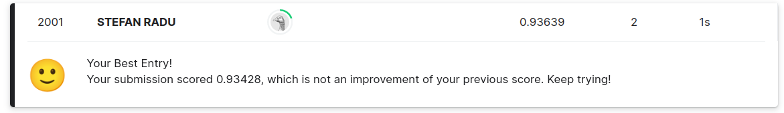

# Fake ML library

### About 

So I call this fake because it's you can't use it for much, as you could for instance
`pytorch`, or any half functional ML library (which mine isn't). But it can still do some
pretty impressive stuff (taht is, if you've never heard about MNIST in the last 10 years).

#### What actually works
- [x] Linear layer
- [x] activation functions
  - Sigmoid
  - ReLU (at least the math says so)
  - LeakyReLU
  - Tanh
- [x] Loss functions
  - MSE
- [x] optimizer 
  - SGD
- [x] saving / loading models
- [x] MNIST dataloader

#### What kinda works?
- [x] cross entropy loss & softmax (not really sure on the math here)

#### What I didn't manage to implement
- a lot of stuff =)))
- [] dropout layer
- [] convolution layers
- [] pooling layers
- [] batch normalization layers
- [] Adam optimizer
- [] standardized dataloader (though it most likely works on that 
precise kaggle csv format)
- [] preprocessing wrappers
- [] multithreading
- [] compatibility layer for loading external models

Yeah... I might have underestimated the difficulty of this.

### Challenges?

1. Understanding backpropagation thoroughly. (which I don't think I fully did)
2. Actully getting backpropagation to work. There were a lot of issues with the
   matrix multiplications not alighning properly.
3. Not figuring out why ReLU performs badly
4. Coding the whole thing
5. Realizing I'm not normalizing the data
6. Lots of other things

### Performance vs Pytorch

I expected this to be a lot worse but...

For a model with:
* a single hidden layer of `size=100`
* sigmoid activation
* MSE loss
* 50 epochs training
* SGD optimizer with `0.1` learning rate

| The Fake One | The real deal |
|:---:|:---:|
| Time: 6m40s | Time: 5m41s |
| Acc: 93.63% | Acc: 97.36% |

- With a kaggle sumission for this model I landed on the exact position of my
 birth year (which is totally intended).

Yeah could've been a lot worse. Like when using ReLu which doesn't seem to work
too well:

For a model with:
* a single hidden layer of `size=100`
* ReLU activation
* MSE loss
* 5 epochs training
* SGD optimizer with `0.1` learning rate

| The Fake One | The real deal |
|:---:|:---:|
| Time: 29s | Time: 20s |
| Acc: 84.21% | Acc: 96.59% |

Even though he didn't help me with this project, he is always there when I need him.
[relu](https://www.youtube.com/watch?v=92pSi7rZJ7c)

### Resurse Utile

[ashwins blog](https://ashwins-code.github.io/posts)
[covnetjs](https://github.com/karpathy/convnetjs/blob/master/src)
[3b1b nn playlist](https://www.youtube.com/playlist?list=PLZHQObOWTQDNU6R1_67000Dx_ZCJB-3pi)
[nnadl](http://neuralnetworksanddeeplearning.com)
[how to implement softmax](https://automata88.medium.com/how-to-implement-the-softmax-derivative-independently-from-any-loss-function-ae6d44363a9d)
[understandin back propagation](https://gotensor.com/2018/11/12/understanding-backpropagation-detailed-review-of-the-backprop-function/)
[cross entropy & softmax](https://www.adeveloperdiary.com/data-science/deep-learning/neural-network-with-softmax-in-python/)

*and maybe others
